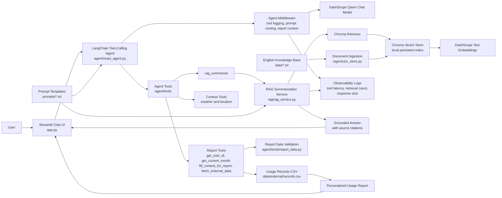

# SmartHome Support AI Agent

An AI customer-support agent for robot vacuum and vacuum-mop products. The app combines a Streamlit chat UI, LangChain tool-calling, Chroma-backed RAG, and personalized usage-report generation.

## Features

- Robot vacuum support chat for troubleshooting, maintenance, buying guidance, and usage questions.
- RAG retrieval over English product-support knowledge files in `data/`.
- Source citations for RAG answers.
- Tool-calling workflow for weather context, user lookup, monthly usage data, and report generation.
- Dynamic prompt switching between support answers and structured usage reports.
- Local eval dataset for tool-routing, report, and prompt-injection scenarios.
- Middleware logging for tool calls, latency, retrieval count, and response size.

## Tech Stack

- Python
- Streamlit
- LangChain and LangGraph middleware
- ChromaDB
- DashScope Qwen chat model
- DashScope text embeddings

## Architecture



## Setup

Create and activate a virtual environment:

```bash
python3 -m venv .venv
source .venv/bin/activate
```

Install dependencies:

```bash
pip install -r requirements.txt
```

Create a local `.env` file:

```bash
cp .env.example .env
```

Edit `.env` and set:

```bash
DASHSCOPE_API_KEY=your-rotated-dashscope-api-key
```

Build the local vector store:

```bash
python rag/vector_store.py
```

Run the app:

```bash
streamlit run app.py
```

## Docker

Build the image:

```bash
docker build -t smarthome-support-agent .
```

Run the container:

```bash
docker run --env-file .env -p 8501:8501 smarthome-support-agent
```

Open the app at `http://localhost:8501`.

Run tests:

```bash
python -m unittest discover -s tests -v
```

Summarize the eval dataset:

```bash
python evals/run_eval.py
```

## Example Questions

- Why is my robot vacuum not returning to the dock?
- How often should I replace the HEPA filter?
- Which robot vacuum features matter most for a pet home?
- How should I maintain a vacuum-mop robot in humid weather?
- Generate my monthly usage report.

## Local Artifacts

The app creates local runtime files such as Chroma databases, logs, bytecode caches, and ingestion hashes. These are intentionally excluded with `.gitignore`.
